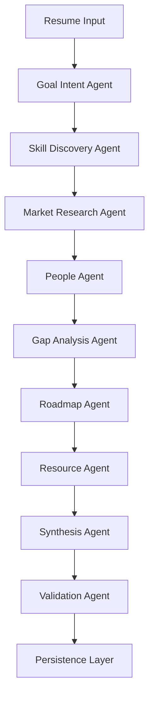

# Placey-macos2

## Team Members
- **Yash Makkar** (yashmakkar5) – Project Lead / Developer

## Problem Statement
The goal is to build a truly dynamic, multi‑agent career intelligence platform that **researches** a user’s concrete goal in real time rather than relying on hard‑coded, generic recommendations. Existing implementations returned static figures (e.g., “Learn from Satya Nadella”), which defeats the purpose of personalized career pathways.

## Solution Overview
Placey‑macos2 orchestrates a pipeline of specialized AI agents (Goal Intent, Skill Discovery, Research, People, Gap Analysis, Roadmap, Resources, Synthesis, Validation) powered by Azure AI Foundry. Each agent consumes the prior step’s structured output, enabling a **feedback‑driven, end‑to‑end workflow** that produces a tailored career trajectory, gap‑analysis, and actionable roadmap.

## Architecture / Data Flow

The diagram above illustrates the sequential data flow where each node emits a **Zod‑validated** schema consumed by the next.

## Technology Stack
- **Framework**: Next.js 16 (TurboPack) – custom agent file handling as per `AGENTS.md`.
- **Language**: TypeScript (strict mode) with **Zod** for runtime schema validation.
- **AI Services**: Azure AI Foundry – `gpt‑4o` (reasoning tier) via `ModelRouter.invokeStructured`.
- **Backend**: Supabase (PostgreSQL) for persistence of analysis records.
- **Version Control**: Git + GitHub.
- **Build / Test**: Node.js (v20), `npm ci`, TypeScript compiler (`npx tsc --noEmit`).

## Setup Instructions
1. **Clone the repository** (if not already local):
   ```bash
   git clone https://github.com/yashmakkar5/Placey-macos2.git
   cd "Placey-macos2"
   ```
2. **Install dependencies**:
   ```bash
   npm ci
   ```
3. **Configure environment variables** (`.env.local`):
   ```
   AZURE_OPENAI_ENDPOINT=<your-azure-endpoint>
   AZURE_OPENAI_API_KEY=<your-key>
   SUPABASE_URL=<your-supabase-url>
   SUPABASE_ANON_KEY=<your-supabase-key>
   ```
4. **Run the development server**:
   ```bash
   npm run dev
   ```
5. **Run the verification script** (optional):
   ```bash
   npx ts-node scripts/verify-full-pipeline.ts
   ```

## Testing & Results
The repository includes `scripts/verify-full-pipeline.ts`, which exercises the full 10‑step agent pipeline on synthetic resumes (e.g., hospitality, AI research). After recent schema updates, the TypeScript compiler passes (`npx tsc --noEmit` returns exit 0). The script now reaches the Validation step, logging any remaining schema mismatches for further refinement.

## Known Limitations
- **Schema brittleness**: AI model outputs sometimes deviate (e.g., strings vs arrays), requiring tolerant Zod unions.
- **Model dependency**: Reliance on Azure AI Foundry; offline fallback not implemented.
- **Test coverage**: Limited automated tests; verification script is manual.
- **Credential management**: Secrets must be supplied via `.env.local` – no secret‑handling automation yet.

## Future Improvements
- Tighten schemas with **custom transformers** to auto‑normalize model responses.
- Add **unit and integration tests** for each agent.
- Implement **retry & fallback** strategies for inconsistent model outputs.
- Introduce CI pipeline that runs the verification script on each push.
- Expand **knowledge sources** (e.g., public APIs, job boards) for richer research.

## Acknowledgements
- **Azure AI Foundry** – for large‑language‑model services.
- **Supabase** – for hosted PostgreSQL persistence.
- **Zod** – schema validation library.
- **Next.js** – web framework providing the UI and server‑side rendering.
- Open‑source community contributors to the TypeScript and React ecosystems.
